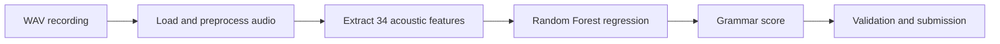

# Grammar Scoring Engine from Speech
<p align="center">
  
</p>

<p align="center"><em>Project-themed banner generated from an internet-hosted image service for a cleaner GitHub presentation.</em></p>

A machine learning pipeline that predicts a continuous grammar-proficiency score from spoken audio. The project was developed for the SHL Intern Hiring Assessment dataset.

## Overview

The system converts each speech recording into a compact acoustic feature vector and uses a Random Forest regressor to estimate a grammar score from 0 to 5.

## Pipeline



## Feature Engineering

Librosa is used to derive statistics from:

- Mel-frequency cepstral coefficients
- spectral centroid
- spectral bandwidth
- zero-crossing rate
- root mean square energy

Each recording becomes a 34-feature numerical representation.

## Dataset

- 409 labeled training recordings
- 197 unlabeled test recordings
- WAV audio, approximately 45–60 seconds per sample
- labels from 0 to 5

The assessment data is not committed to this repository. Place the downloaded files in the paths expected by the notebook before running it.

## Model and Results

The notebook trains a `RandomForestRegressor` and evaluates it with RMSE and Pearson correlation.

| Metric | Saved run |
|---|---:|
| Training RMSE | 0.276 |
| Validation RMSE | 0.706 |
| Pearson correlation | 0.436 |

These figures describe one validation split and are not a production benchmark.

## Outputs

- extracted training and test feature matrices
- validation plots and metrics
- `submission.csv` with predicted test scores

## Tech Stack

- Python
- Librosa and SoundFile
- NumPy and Pandas
- scikit-learn and SciPy
- Matplotlib
- Jupyter

## Project Structure

```text
.
|-- grammar-scoring-engine.ipynb
|-- requirements.txt
|-- submission.csv
`-- README.md
```

## Installation and Usage

```bash
git clone https://github.com/guru8880/grammar_scoring_engine.git
cd grammar_scoring_engine
python -m venv venv
```

```bash
# Windows
venv\Scripts\activate

# macOS/Linux
source venv/bin/activate
```

```bash
pip install -r requirements.txt
jupyter lab
```

Open `grammar-scoring-engine.ipynb`, set the dataset paths, and run the cells in order.

## Limitations

- Acoustic features describe delivery but do not directly parse spoken grammar.
- The dataset is small, so results can be sensitive to the validation split.
- Noise, microphone quality, and speaker characteristics can affect predictions.

## Future Improvements

- transcribe speech and add text-based grammar features
- use cross-validation and confidence intervals
- compare pretrained speech embeddings and boosting models
- package feature extraction and inference into a reusable pipeline
